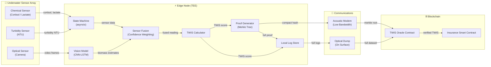
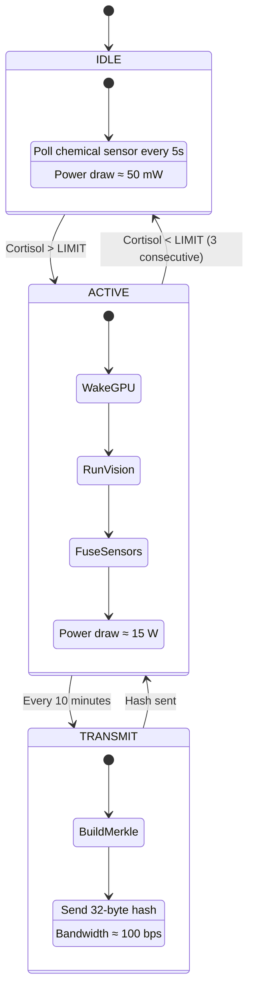
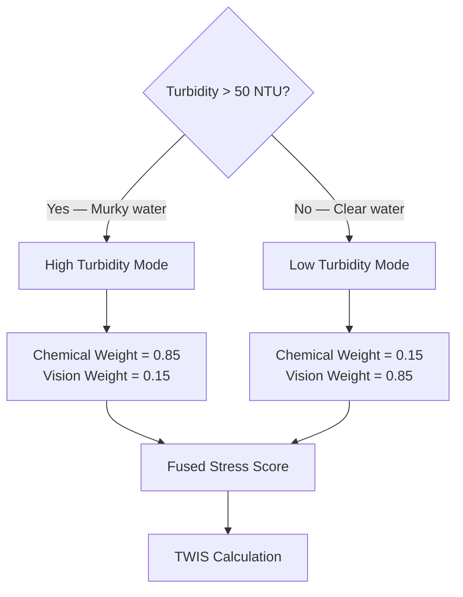
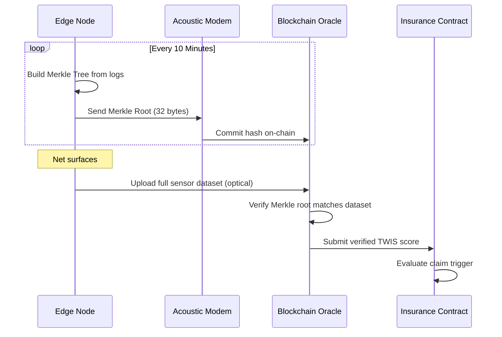

# Guardian Oracle TAM — System Architecture

## Overview

The **Guardian Oracle TAM** is an edge-AI–powered smart trawling net that monitors marine ecological stress in real time. It calculates a **Trophic-Web Integrity Score (TWIS)** using fused sensor data, then cryptographically commits proof-of-observation to a blockchain oracle for insurance smart-contract verification.

---

## Tech Stack

| Layer | Technology | Role |
|---|---|---|
| Edge Controller | Python 3.11+ / `asyncio` | Hierarchical wake-on-event state machine |
| AI Inference | PyTorch (simulated) | CNN-LSTM species classification on Jetson GPU |
| Sensor Drivers | Python `dataclasses` | Chemical (Cortisol/Lactate), Optical, Turbidity |
| Cryptographic Proof | `hashlib` SHA-256 | Merkle-tree compact proofs for acoustic link |
| Blockchain Oracle | Solidity 0.8.x | On-chain TWIS verification & claim triggers |
| Testing | `pytest` + simulation | Unit tests + 60-minute haul simulation |

---

## System Architecture Diagram



---

## Power State Machine



---

## Sensor Fusion — Confidence Weighting

The system dynamically re-weights sensor trust based on water clarity:



> **Rationale:** In murky water (high turbidity), the camera's species classification degrades. The system shifts trust to chemical biomarkers (cortisol/lactate) which remain reliable regardless of visibility.

---

## TWIS Formula

```
TWIS = 1 - (Biomass_gelatinous / (Biomass_gelatinous + Biomass_commercial))
```

| TWIS Score | Interpretation |
|---|---|
| 0.8 – 1.0 | Healthy ecosystem — dominated by commercial species |
| 0.5 – 0.8 | Moderate stress — jellyfish presence increasing |
| 0.0 – 0.5 | Severe stress — gelatinous species dominating |

---

## Oracle Verification — Store-and-Forward Protocol

1. **Every 10 minutes**: Edge node builds a Merkle tree from accumulated sensor logs
2. **Acoustic Link** (≈ 100 bps): Transmits only the 32-byte Merkle root hash
3. **On Surfacing**: Full dataset is dumped via optical link for on-chain verification
4. **Smart Contract**: Compares acoustic-committed hash against full-data hash to verify integrity



---

## Directory Structure

```
guardian_oracle_tam/
├── docs/
│   └── architecture.md          # This file
├── edge_node/
│   ├── __init__.py
│   ├── state_machine.py         # Asyncio wake-on-event controller
│   └── twis.py                  # TWIS score calculation
├── sensors/
│   ├── __init__.py
│   ├── chemical_sensor.py       # Cortisol / Lactate simulation
│   ├── optical_sensor.py        # Camera frame simulation
│   └── turbidity_sensor.py      # Turbidity (NTU) simulation
├── ai_models/
│   ├── __init__.py
│   ├── sensor_fusion.py         # Confidence-weighted fusion
│   └── vision_model.py          # Simulated CNN-LSTM
├── blockchain/
│   ├── __init__.py
│   ├── proof_generator.py       # Merkle tree & compact proof
│   └── oracle_interface.sol     # Solidity oracle contract
└── tests/
    ├── __init__.py
    ├── test_twis.py              # TWIS unit tests
    ├── test_escape_reflex.py     # State transition tests
    └── simulation_run.py         # 60-minute haul simulation
```
