# Guardian Oracle TAM — System Architecture

## Overview

The **Guardian Oracle TAM** is an edge-AI–powered smart trawling net that monitors marine ecological stress in real time. It calculates a **Trophic-Web Integrity Score (TWIS)** using fused sensor data, then cryptographically commits proof-of-observation to a blockchain oracle for insurance smart-contract verification.

---

## Tech Stack

| Layer | Technology | Role |
|---|---|---|
| Edge Controller | Python 3.11+ / `asyncio` | Hierarchical wake-on-event state machine |
| AI Inference | PyTorch (simulated) | CNN-LSTM species classification on Jetson GPU |
| Sensor Drivers | Python `dataclasses` | Chemical (Cortisol/Lactate), Optical, Turbidity |
| Cryptographic Proof | `hashlib` SHA-256 | Merkle-tree compact proofs for acoustic link |
| Blockchain Oracle | Solidity 0.8.x | On-chain TWIS verification & claim triggers |
| Testing | `pytest` + simulation | Unit tests + 60-minute haul simulation |

---

## System Architecture Diagram

```mermaid
graph LR
    subgraph Underwater["🌊 Underwater Sensor Array"]
        CS["Chemical Sensor<br/>(Cortisol / Lactate)"]
        TS["Turbidity Sensor<br/>(NTU)"]
        OS["Optical Sensor<br/>(Camera)"]
    end

    subgraph EdgeNode["⚡ Edge Node (TEE)"]
        SM["State Machine<br/>(asyncio)"]
        SF["Sensor Fusion<br/>(Confidence Weighting)"]
        VM["Vision Model<br/>(CNN-LSTM)"]
        TW["TWIS Calculator"]
        PG["Proof Generator<br/>(Merkle Tree)"]
        LOG["Local Log Store"]
    end

    subgraph Comms["📡 Communications"]
        AM["Acoustic Modem<br/>(Low Bandwidth)"]
        OD["Optical Dump<br/>(On Surface)"]
    end

    subgraph Blockchain["⛓️ Blockchain"]
        OC["TWIS Oracle Contract"]
        SC["Insurance Smart Contract"]
    end

    CS -->|cortisol, lactate| SM
    TS -->|turbidity NTU| SM
    OS -->|video frames| VM

    SM -->|sensor data| SF
    SF -->|fused reading| TW
    VM -->|biomass estimates| SF
    TW -->|TWIS score| PG
    TW -->|TWIS score| LOG

    PG -->|compact hash| AM
    PG -->|full proof| LOG
    LOG -->|full logs| OD

    AM -->|merkle root| OC
    OD -->|full dataset| OC
    OC -->|verified TWIS| SC
```



---

## Power State Machine

```mermaid
stateDiagram-v2
    [*] --> IDLE

    IDLE --> ACTIVE : Cortisol > LIMIT
    ACTIVE --> IDLE : Cortisol < LIMIT (3 consecutive)
    ACTIVE --> TRANSMIT : Every 10 minutes
    TRANSMIT --> ACTIVE : Hash sent

    state IDLE {
        [*] --> PollChemical
        PollChemical : Poll chemical sensor every 5s
        PollChemical : Power draw ≈ 50 mW
    }

    state ACTIVE {
        [*] --> WakeGPU
        WakeGPU --> RunVision
        RunVision --> FuseSensors
        FuseSensors --> CalcTWIS
        CalcTWIS : Power draw ≈ 15 W
    }

    state TRANSMIT {
        [*] --> BuildMerkle
        BuildMerkle --> AcousticSend
        AcousticSend : Send 32-byte hash
        AcousticSend : Bandwidth ≈ 100 bps
    }
```



---

## Sensor Fusion — Confidence Weighting

The system dynamically re-weights sensor trust based on water clarity:

```mermaid
graph TD
    T{"Turbidity > 50 NTU?"}
    T -->|Yes — Murky water| HT["High Turbidity Mode"]
    T -->|No — Clear water| LT["Low Turbidity Mode"]

    HT --> W1["Chemical Weight = 0.85<br/>Vision Weight = 0.15"]
    LT --> W2["Chemical Weight = 0.15<br/>Vision Weight = 0.85"]

    W1 --> FUSE["Fused Stress Score"]
    W2 --> FUSE
    FUSE --> TWIS["TWIS Calculation"]
```



> **Rationale:** In murky water (high turbidity), the camera's species classification degrades. The system shifts trust to chemical biomarkers (cortisol/lactate) which remain reliable regardless of visibility.

---

## TWIS Formula

```
TWIS = 1 - (Biomass_gelatinous / (Biomass_gelatinous + Biomass_commercial))
```

| TWIS Score | Interpretation |
|---|---|
| 0.8 – 1.0 | Healthy ecosystem — dominated by commercial species |
| 0.5 – 0.8 | Moderate stress — jellyfish presence increasing |
| 0.0 – 0.5 | Severe stress — gelatinous species dominating |

---

## Oracle Verification — Store-and-Forward Protocol

1. **Every 10 minutes**: Edge node builds a Merkle tree from accumulated sensor logs
2. **Acoustic Link** (≈ 100 bps): Transmits only the 32-byte Merkle root hash
3. **On Surfacing**: Full dataset is dumped via optical link for on-chain verification
4. **Smart Contract**: Compares acoustic-committed hash against full-data hash to verify integrity


---

## Directory Structure

```
guardian_oracle_tam/
├── docs/
│   └── architecture.md          # This file
├── edge_node/
│   ├── __init__.py
│   ├── state_machine.py         # Asyncio wake-on-event controller
│   └── twis.py                  # TWIS score calculation
├── sensors/
│   ├── __init__.py
│   ├── chemical_sensor.py       # Cortisol / Lactate simulation
│   ├── optical_sensor.py        # Camera frame simulation
│   └── turbidity_sensor.py      # Turbidity (NTU) simulation
├── ai_models/
│   ├── __init__.py
│   ├── sensor_fusion.py         # Confidence-weighted fusion
│   └── vision_model.py          # Simulated CNN-LSTM
├── blockchain/
│   ├── __init__.py
│   ├── proof_generator.py       # Merkle tree & compact proof
│   └── oracle_interface.sol     # Solidity oracle contract
└── tests/
    ├── __init__.py
    ├── test_twis.py              # TWIS unit tests
    ├── test_escape_reflex.py     # State transition tests
    └── simulation_run.py         # 60-minute haul simulation
```
